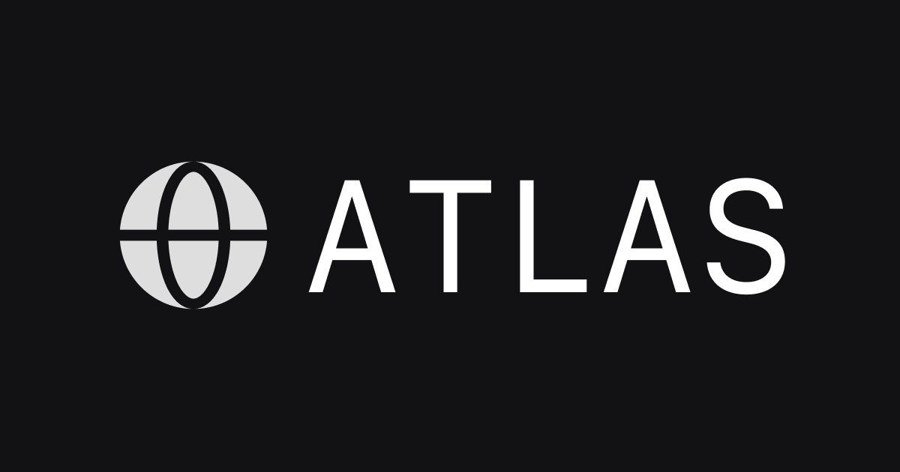

# atlas



A CLI for exploring ENS

## Installation

Install using your package manager of choice

```bash
npm i -g @stevedylandev/atlas
```

Make sure it worked by running `atlas`

```bash
atlas
```

## Usage

By default Atlas will use `https://eth.drpc.org` but you can use a custom RPC by setting the environment variable `ETH_RPC_URL` in your shell.

### `resolve`
Resolve an ENS name to an address or vice versa

```bash
# Resolve ENS name to address
atlas resolve vitalik.eth
# 0xd8dA6BF26964aF9D7eEd9e03E53415D37aA96045

# Resolve address to ENS name
atlas resolve 0xd8dA6BF26964aF9D7eEd9e03E53415D37aA96045
# vitalik.eth

# Get a specific TXT record
atlas resolve vitalik.eth --txt com.github
# vbuterin

# Get content hash
atlas resolve vitalik.eth --contenthash
# bafybeig5wyxzxlhleqtop6n3eevoscfvfwlijfuo6vfvyl3zskadapoglq

# Get address for a specific chain
atlas resolve vitalik.eth --chain ETH
# 0xd8dA6BF26964aF9D7eEd9e03E53415D37aA96045
```

### `profile`
Display a complete ENS profile with all records

```bash
# Show full profile for an ENS name or address
atlas profile vitalik.eth
atlas profile 0xd8dA6BF26964aF9D7eEd9e03E53415D37aA96045

# ENS Profile
# ============
#
# Name:        vitalik.eth
# Address:     0xd8dA6BF26964aF9D7eEd9e03E53415D37aA96045
#
# Text Records:
# Website:     https://vitalik.ca
# Avatar:      https://euc.li/vitalik.eth
# Bio:         mi pinxe lo crino tcati
# Twitter:     VitalikButerin
# GitHub:      vbuterin
# Header:      https://pbs.twimg.com/profile_banners/295218901/1638557376/1500x500
# Avatar:      https://euc.li/vitalik.eth
# Bio:         mi pinxe lo crino tcati
# Website:     https://vitalik.ca
# GitHub:      vbuterin
# Twitter:     VitalikButerin
#
# Coin Records:
# ETH:       0xd8dA6BF26964aF9D7eEd9e03E53415D37aA96045
#
# Content Hash:
# Type:        ipfs
# Hash:        bafybeig5wyxzxlhleqtop6n3eevoscfvfwlijfuo6vfvyl3zskadapoglq
#
# Resolver:    0x231b0Ee14048e9dCcD1d247744d114a4EB5E8E63
```

### `namehash`
Generate a namehash for an ENS name

```bash
atlas namehash vitalik.eth
# 0xee6c4522aab0003e8d14cd40a6af439055fd2577951148c14b6cea9a53475835
```

### `labelhash`
Generate a labelhash for an ENS name

```bash
atlas labelhash vitalik
# 0xaf2caa1c2ca1d027f1ac823b529d0a67cd144264b2789fa2ea4d63a67c7103cc
```

### `resolver`
Get the current resolver address for an ENS name

```bash
atlas resolver vitalik.eth
# 0x231b0Ee14048e9dCcD1d247744d114a4EB5E8E63
```

### `deployments`
List deployed ENS contracts

```bash
atlas deployments
# Chain ID: 1
#   ensBaseRegistrarImplementation: 0x57f1887a8BF19b14fC0dF6Fd9B2acc9Af147eA85
#   ensBulkRenewal: 0xa12159e5131b1eEf6B4857EEE3e1954744b5033A
#   ensDnsRegistrar: 0xB32cB5677a7C971689228EC835800432B339bA2B
#   ensDnssecImpl: 0x0fc3152971714E5ed7723FAFa650F86A4BaF30C5
#   ensEthRegistrarController: 0x253553366Da8546fC250F225fe3d25d0C782303b
#   ensNameWrapper: 0xD4416b13d2b3a9aBae7AcD5D6C2BbDBE25686401
#   ensPublicResolver: 0x231b0Ee14048e9dCcD1d247744d114a4EB5E8E63
#   ensRegistry: 0x00000000000C2E074eC69A0dFb2997BA6C7d2e1e
#   ensReverseRegistrar: 0xa58E81fe9b61B5c3fE2AFD33CF304c454AbFc7Cb
#   ensUniversalResolver: 0xce01f8eee7E479C928F8919abD53E553a36CeF67
# Chain ID: 5
#   ensBaseRegistrarImplementation: 0x57f1887a8BF19b14fC0dF6Fd9B2acc9Af147eA85
#   ....
```

## Development

Make sure [Bun](https://bun.sh) is installed

```bash
bun --version
```

Clone the repo and install dependencies

```bash
git clone https://github.com/stevedylandev/atlas
cd atlas
bun install
```

After making changes use the `dev` command to create a symlink to test it

```bash
bun dev

atlas resolve vitalik.eth
```

> [!NOTE]
> If you don't see any changes, make sure you uninstall any previously installed versions. If you use Bun it should overwrite but you can always manually fix it:
> ```bash
> which atlas | xargs rm
> ```

## Feedback

If you have any issues or feature requests please feel free to [open an issue](https://github.com/stevedylandev/atlas/issues/new)!
